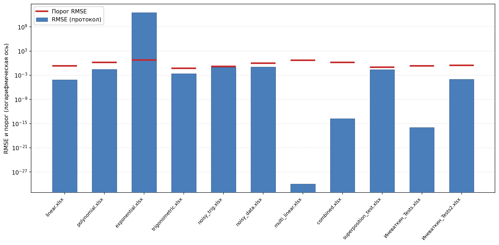

# 4 МЕТОДИКА ВЫЧИСЛИТЕЛЬНОГО ЭКСПЕРИМЕНТА И АНАЛИЗ РЕЗУЛЬТАТОВ

Глава суммирует **результаты** прогонов программного комплекса на контрольных таблицах и даёт **интерпретацию** цифр и записей протокола. Формат входных **.xlsx**, разделение режимов **1D** / многомерный сценарий, состав метрик (**RMSE**, **R²**, hold-out, сводка **benchmark**) и логика **кода** уже изложены в **гл. 2–3** — здесь это не повторяется.

## 4.1 Условия контрольного эксперимента и перечень наборов

Эксперимент опирается на искусственные книги **Excel**, где ожидаемый вид зависимости известен заранее: так проще судить о качестве SR/GP без подгонки «удачных» реальных данных [5] (при необходимости — сокращённый набор сценариев при тех же критериях отчёта [1] [2]). Фактический **поток** «рабочий каталог → запуск консольного модуля → **`result.txt`** → сверка с порогами из **`gp_settings.json`**» показан на **рис. 4.1** (файл **`diplom/diagrams/fig_4_1_experiment_workflow.drawio`**).

**Таблица 4.1** задаёт **перечень** контрольных файлов, их режим, краткую «эталонную» постановку и **порог RMSE** из **`benchmarkThresholds`** (имена файлов должны совпадать с ключами JSON). Именно по этой таблице удобно сопоставлять ожидание и то, что окажется в протоколе и в **табл. 4.2–4.3**.

| № | Файл .xlsx | Режим | Ожидаемая истина (кратко) | Порог RMSE в JSON |
|---|------------|-------|---------------------------|-------------------|
| 1 | linear.xlsx | 1D | линейная | 0,2 |
| 2 | polynomial.xlsx | 1D | полином | 1,5 |
| 3 | exponential.xlsx | 1D | экспонента (**y > 0**) | 6,0 |
| 4 | trigonometric.xlsx | 1D | тригонометрия | 0,05 |
| 5 | noisy_data.xlsx | 1D | линейная + шум | 1,0 |
| 6 | noisy_trig.xlsx | 1D | тригонометрия + шум | 0,15 |
| 7 | multi_linear.xlsx | MD | линейная по **x₁, x₂** | 5,0 |
| 8 | combined.xlsx | MD | нелинейная комбинация | 1,5 |
| 9 | superposition_test.xlsx | MD + **φ** | суперпозиция (нужен **`base_functions.txt`**) | 0,1 |
| 10 | Иневаткин_Tests.xlsx | по файлу | авторский набор | 0,2 |
| 11 | Иневаткин_Tests2.xlsx | по файлу | авторский набор | 0,3 |

Численные **табл. 4.2** (сводка **benchmark**: файл, **RMSE**, относительная ошибка, порог, **PASS/FAIL**) и **табл. 4.3** (найденные формулы по файлам) при сборке черновика ВКР подставляются **`diplom/build_docx.py`** из актуального **`kursovaia/kursovaia/result.txt`**; в готовом **Word** они следуют сразу после данной главы (оформление подписей — по методичке кафедры). Полный текст протокола при необходимости — в **приложении** к документу.

## 4.2 Анализ полученных результатов

Ниже приведён разбор **фактического прогона**, отражённого в **`kursovaia/kursovaia/result.txt`** на момент подготовки записки (те же данные попадают в **табл. 4.2–4.3** при сборке **Word**). Общая логика критериев: для каждой строки benchmark проверяются **абсолютный** допуск (**RMSE** ≤ порог из **`gp_settings.json`**) и **относительный** (**rel** = **RMSE**/**yRange** ≤ **0,005**); в сводке **PASS** выставляется при выполнении **хотя бы одного** из условий (в коде — дизайн для наборов с очень большим размахом **y**). Пояснение в скобках **(abs+rel)**, **(abs)** или **(rel)** показывает, какое из условий «поддержало» прохождение.

**Рисунок 4.2** (файл **`diplom/diagrams/fig_4_2_rmse_vs_threshold.png`**, скрипт **`diplom/plot_fig_4_2.py`**) наглядно сопоставляет **RMSE** и порог: столбцы — по протоколу, красные отрезки — допуски. Ось **Y** — **логарифмическая** (из‑за **exponential.xlsx**); нулевая ошибка в логе отображается у нижней границы шкалы.

**Выводы по табл. 4.2 (численная сводка).** В протоколе зафиксировано **11/11** успешных строк benchmark — все контрольные файлы из **табл. 4.1** получили **PASS**. Для большинства наборов выполняются **оба** неравенства — пометка **(abs+rel)** (**linear**, **polynomial**, **trigonometric**, **noisy_data**, **multi_linear**, **combined**, **superposition_test**, **Иневаткин_Tests** и **Иневаткин_Tests2**): и абсолютный **RMSE**, и **rel** укладываются в заданные пределы. Два особых случая отражают именно **разработанную** схему допусков, а не «ошибку таблицы». **exponential.xlsx:** **RMSE** порядка **10¹²** существенно **выше** порога **6,0**, зато **rel** ≈ **6,5·10⁻³²** — ошибка ничтожна по отношению к размаху **y**; статус **PASS (rel)** корректно интерпретируется как успех по **относительному** критерию при «взрывном» масштабе отклика. **noisy_trig.xlsx:** наоборот, **RMSE** **0,095** < **0,15** (**abs** выполняется), а **rel** ≈ **0,024** **выше** порога **0,005** — шум и форма сигнала дают большую долю ошибки в размахе **y**; тем не менее запись **PASS (abs)** фиксирует прохождение по **абсолютному** допуску. **Иневаткин_Tests2.xlsx** демонстрирует уже **согласованно малую** ошибку по обоим критериям при сложной нелинейной структуре модели (см. ниже). Итого: сводка **табл. 4.2** подтверждает работоспособность конвейера «метрика → пороги → итог» и показывает, **зачем** в отчёте дублируются **абсолютный** и **относительный** показатели.

**Выводы по табл. 4.3 и полному тексту `result.txt` (смысловой разбор формул).** Протокол по **одномерным** эталонам согласуется с ожидаемым классом зависимости: **linear.xlsx** — эквивалент **2x + 1** (запись вида **x₁ + (x₁ + 0,9999)**); **polynomial.xlsx** — квадратичный тренд (**x²** с уточнёнными коэффициентами); **exponential.xlsx** — структура **2·exp(x)**; **trigonometric.xlsx** — **sin(x)**. Файл **custom_function.xlsx** (в benchmark не входит, но есть в протоколе и **табл. 4.3**) даёт **x³ + 1** с машинной точностью — полезный контроль вне жёсткой сводки. **Шум:** **noisy_data.xlsx** остаётся **линейной** оценкой с **RMSE** выше «чистого» линейного случая; **noisy_trig.xlsx** — **sin** с подобранной амплитудой и фазой. **Многомерные книги:** в **multi_linear.xlsx** по **test RMSE** побеждает **линейный** baseline (**(−5 + 3x₁ + 2x₂)**), GP уступает — в логе явно видно сравнение кандидатов; в **combined.xlsx** формула **sin(x₁) + x₂²** восстановлена **GP** с нулевой ошибкой на выборке. **superposition_test.xlsx:** выбрана ветвь **log-fit** (**exp(…)** от гладкой функции у **cos**), что соответствует срабатыванию эвристики логарифма по протоколу. Авторские **Иневаткин_Tests.xlsx** и **Иневаткин_Tests2.xlsx:** первая таблица сводится к **линейной** зависимости от факторов; вторая — к сложному выражению с **sin**, **exp** и произведением **x₁x₂**, что отражает нетривиальную генерируемую зависимость при сохранении **низких** **RMSE** и **rel**.

**Скриншоты фрагментов `result.txt` (по требованию методички или научного руководителя).** **Табл. 4.2–4.3** и **рис. 4.2** уже дают **сжатые** итоги; полный протокол может быть в **приложении**. Скриншоты тогда **не** дублируют числа и выводы письменного анализа, а выполняют две иные функции: **(1)** наглядно показывают **форму выхода** программы («как выглядит отчёт для проверяющего»); **(2)** фиксируют **цепочку доверия** «строка в логе → строка в таблице записки» без перепечатывания десятков страниц **`result.txt`**. Если методист не требует иллюстраций экрана/лога, этот блок можно опустить: достаточно таблиц, **рис. 4.2** и **приложения** с полным текстом.

К **скриншотам** в **Word** добавляют **подпись по ГОСТ/шаблону кафедры** (часто **«Рисунок … — …»** под рисунком, шрифт как у подписей к рисункам). Нумерацию продолжают после **рис. 4.2** (например **рис. 4.3**, **4.4**…). В подписи кратко указывают **источник** (**фрагмент файла `result.txt`**, дата прогона или путь при необходимости) и **содержание кадра** (**не** пересказывают весь §4.2 — один–два предложения «что на снимке видно» и **ссылка** на уже данный вывод). Текст **внутри** скриншота желательно **моноширинный** (как в редакторе) и **обрезан** по полезной области без лишнего рабочего стола.

Примеры формулировок подписей (подставьте свои номера **рис.** и при необходимости имя файла из прогона):

- **1D:** *«Рисунок 4.3 — Фрагмент протокола для одномерного набора (**trigonometric.xlsx**): классификация типа данных и итоговая формула; соответствует смысловым выводам по §4.2 (восстановление **sin x**).»* Можно взять **linear.xlsx**, если нужно показать ветвь **direct** без **log-fit**.
- **Многомерный файл:** *«Рисунок 4.4 — Список кандидатов (**multi_linear.xlsx**) с **RMSE** на обучающей и тестовой выборке; иллюстрирует выбор линейного baseline, о котором сказано в §4.2.»* Либо **combined.xlsx**: *«… иллюстрирует преимущество модели **GP** на тесте (см. §4.2).»*
- **Benchmark:** *«Рисунок 4.5 — Завершающий блок протокола **`=== Benchmark summary ===`**: соответствует **табл. 4.2**; видны пометки **PASS** и уточнения **(abs+rel)** / **(abs)** / **(rel)**.»*

В **основном тексте** рядом со скриншотом достаточно **одной фразы**-отсылки, например: *«Структура вывода по одномерному сценарию показана на **рис. 4.3**; сравнение кандидатов в многомерном режиме — на **рис. 4.4**.»* Повторный разбор **exponential**/**noisy_trig** в подписях **не** обязателен — он уже в абзаце про **табл. 4.2**.

**Характерные случаи при интерпретации (справочно).** Для **exponential.xlsx** нельзя судить только по **абсолютному** **RMSE** без **yRange**. На **шумных** наборах **rel** может ухудшаться сильнее **abs** — как в **noisy_trig.xlsx**. Для **superposition_test.xlsx** выводы о суперпозиции корректны только при прогоне с непустым **`base_functions.txt`** (см. гл. 3).

**Вывод.** По результатам рассмотренного прогона комплекс **на полном контрольном наборе** даёт приемлемые модели: **табл. 4.2** фиксирует **100 %** **PASS** при осмысленном различии критериев **(abs+rel)**, **(abs)** и **(rel)**; **табл. 4.3** и текст **`result.txt`** показывают согласование структуры формул с типом данных (включая случаи, когда оптимален **baseline**, а не **GP**). Вместе с **рис. 4.1–4.2** это демонстрирует воспроизводимый цикл «пакет **.xlsx** → единый протокол → количественная и качественная оценка».
